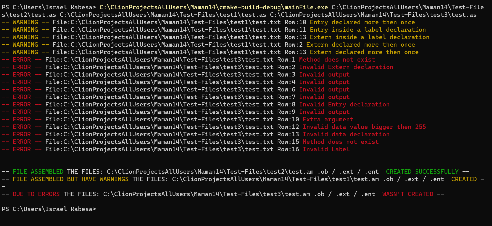

    <h1>Assembler</h1>
    
An assembler Me and my colleague Isreal written in C that translates assembly language code into machine code.

  
    
    

    <h2>Description</h2>
    
This project is an assembler implemented in the C programming language.
    The assembler takes assembly language source code as input and generates corresponding machine code as output.

    <h2>Features</h2>
    <ul>
        <li>Translates assembly language source code into machine code.</li>
        <li>Supports a predefined set of assembly instructions and addressing modes.</li>
        <li>Handles labels, variables, constants, and comments in the assembly code.</li>
        <li>Provides error handling for syntax and semantic errors in the source code.</li>
        <li>Utilizes pre Assembler and two-pass method for translation.</li>
    </ul>

    <h2>Testing and Validation</h2>
    
Extensive testing and validation has been performed to ensure the memory leaks and correctness of the assembler. The following steps were taken:

    <ul>
        <li>Multiple test cases were designed to cover various edge cases.</li>
        <li>The assembler was executed with these test cases, and the generated machine code was verified.</li>
        <li>Automated testing scripts were created to ensure consistent results across different environments.</li>
        <li>Valgrind was utilized to analyze memory usage and check for memory leaks. No memory leaks were detected.</li>
        <li>Tested on Ubuntu, Linux and Windows environments.</li>
    </ul>

    <h2>Usage</h2>
    <ol>
        <li>Create an assembly source code file (e.g., <code>input.asm</code>) following the supported syntax.</li>
        <li>Run the assembler, providing the source file as input and specifying an output file for the machine code.</li>
        <li>Review the output machine code file (output.obj / ent / ext).</li>
    </ol>

